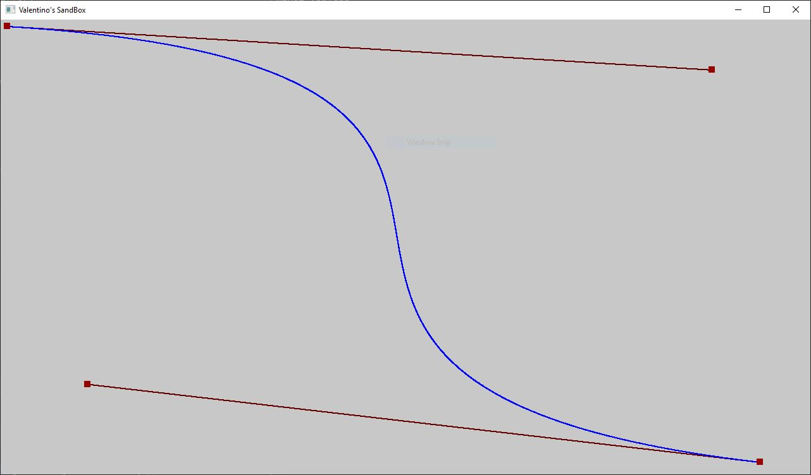

# Wellcome to VSB
VSB is a game engine and stands for Valentino's SandBox, therefore this is my sandbox.
Are you wondering what do I mean by sandbox? Well, it is the place where I am free to experiment and play with code just as a kid would do with sand. My main intent is to build or reproduce game mechanics and features even if sometimes I make whole disasters and I need to start over.

## Goals
The main goal for this project is to be a well-rounded learning experience.
I would like to:

 - Improve as much as possible my ability to write complex and yet understandable code, free from programming paridigms and dogmas.
 - Understand the fundamentals of game architecture and programming, building everything from scratch with no third party libraries
 - Challenge myself and push my skills to the limits to see what am I really able to accomplish

## Project Architecture
The project is made of two main parts: the (basic) windows platform layer and the game layer.
The platform layer handles the windows api, the input, file I/O, and the memory management and passes these to the game layer that processes them according to the game logic and then draws the next frame to be shown by the platform layers.

## Features
I will continue to update this list with present and planned features.
 - [x] Software rendering
 - [x] Keyboard and Xbox gamepad input
 - [x] Basic code profiling tools
 - [x] Basic file I/O
 - [x] Fixed frame rate
 - [x] Live code editing
 - [ ] Bitmap loading
 
# Experiments
Here I will list all the experiment that I will be doing during the development and I will show the result.

## Interpolation and Bezier curve rendering
While studying for university I came across the theory behind the Bezier curves and decided to try to implement one myself. The code can be found in `test_interpolation.cpp`
